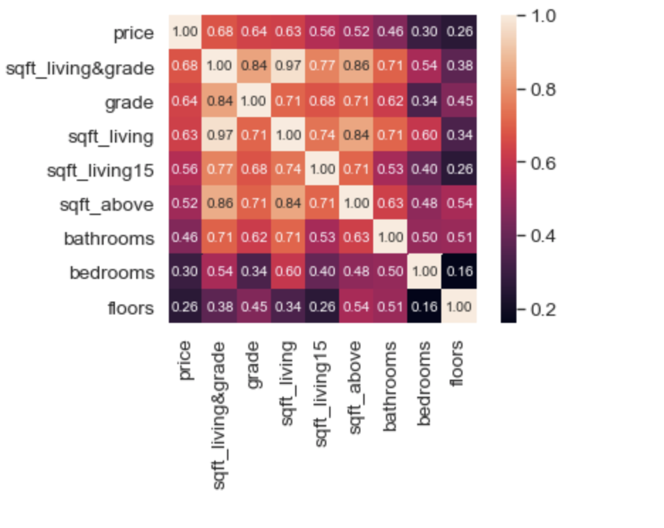
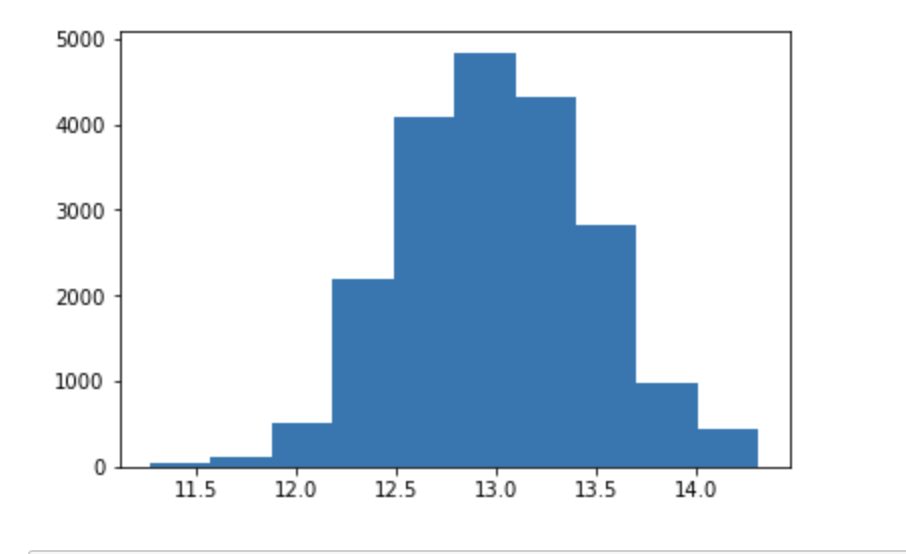
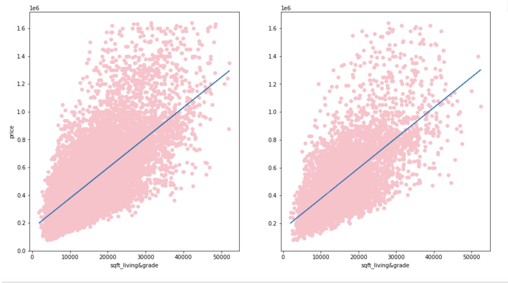

# Phase Two Project 

## Authors: 
Dorothy Alexander and Will Cline

## Overview

This project helps people who are looking to put their house on the market find the best estimate of their sale price. Descriptive analysis helps to show how other factors effect the price of the house that is on the market. Some factors effect the direct price of the house more drastically than other factors we assessed.

## Business Problem
Predictive:

 Looking specifically in King County that is in Seattle, WA a real estate firm has a new investor that would like to format a tool that will allow their clients to input information about their home and receive an output/prediction for their home's sale price. The real estate company and their new investor have hired us to create a predictive model that will allow a prediction of the sale price of a specific home that is in the meadian as accurately as possible.

 ## Data
 The data sources included are:
 kc_house_data.csv 

 ## Methods
 We focused on the price of the house for our dependent variable. In order to decide on our main independent variable we looked at the rest of the data and which variables had the highest correlation which ended up being the square foot of the house and the grade of the house. The grade of a house in this county is on a scale of 1 to 13. The low end is the range 1-3 which means that the house is not up to the right standard of the design of the house and the state of construction. If the house grade is a 7 it is considered average and if it falls in the range of 11-13 then it is at a high standard of design and construction.

 ## Results
### Visual 1

Used a heat map to confirm correlation of independent variables with our dependent variable. The top two correlated values are grade and sqaure foot of living so we combined the two. This visualization confirms that when combining the top two correlated values it became an even stronger correltaion with price. 

### Visual 2

Decided to scale the dependent variable to help with the independent variables and make the output in line with each other. We eliminated outliers of price which included lower priced and higher priced homes because we are focusing on the middle class and middle priced homes. Using log on the price was the best way we found to eliminate the original price range that created the large skew.

### Visual 3

This is a train, test, split model as a visualization. Doing a train, test, split is used to test how well our algorithm was working with regression. It divided our dataset into two subsets. The blue line is used to show the predicted value and the pink are all of the values. This is showing a positive correlation between price and square foot of living and grade. 

 ## Conclusions
Our predictive model uses price as the output. We did most of our analysis on square foot of living and grade. We created an interactive model, guided user interface, where you can actually input any of the columns in the dataframe such as bedrooms, bathrooms, and other features of the house. This model that looks at multiple features will work for the business problem that the real estate company was asking for in the business problem.

 ## Next Steps
It would be beneficial for the real estate company to set the guided user interface on a website so their clinates can use it. It would be important for them to make it user friendly. It would also be smart to have login information so their clients could login to the guided user interface and can save the data they found within the guidlines they put in the guided user interface. 

 ## For More Information
Please review our full analysis in  or our .

For any additional questions, please contact Dorothy Alexander & dcalexan@bsc.edu, Will Cline & wrcline@bsc.edu

 ## Repository Structure 

project-folder

    |
    README.md
    data-folder
    images-folder
    notebooks-folder
          |
          report.ipynb
          exploratory-folder
                  |
                  member-1-notebooks-folder
                  member-2-notebooks-folder 
                  member-3-notebooks-folder 

# Happy Home Helper
Our best model encorporates these columns: bedrooms', 'bathrooms', 'sqft_living', 'sqft_lot', 'floors', 'grade',
'sqft_above', 'sqft_living15', 'sqft_lot15', 'age', 'months_ago_sold';
one hot encoded zip code; and these columns made from multiplying other top correlated models: 'sqft_living&above',
'sqft_living&grade', 'sqft_living&living15', 'grade&sqft_above', 'bathrooms&sqft_living', 'sqft_above&sqft_living15',
'grade&sqft_living15'

